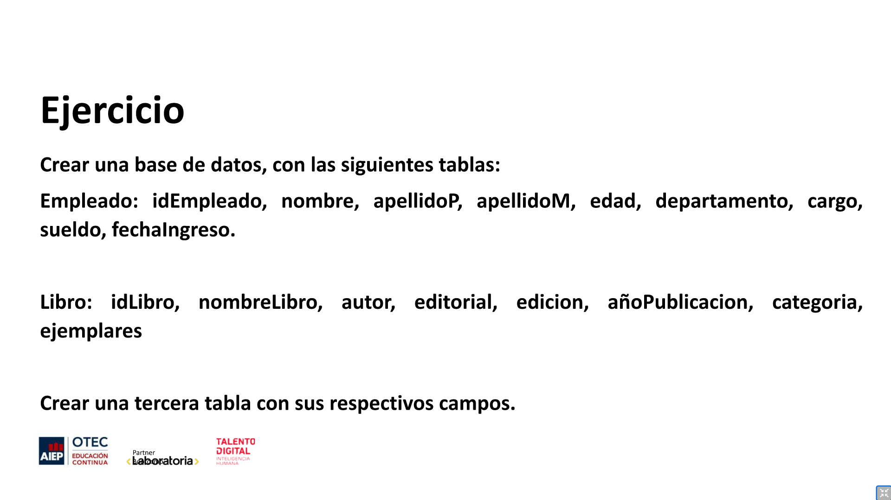

# MODULO 2 - Base de Datos | Ignacio Cavallo

---

## Clase 27 | 04-06

### Conceptos Aprendidos:

**En clase:**

1. Creación de Tablas.
2. Selección de Tablas.
3. Insertar valores en forma de fila a la Tabla.

**Fuera de Clase:**

1. Utilizar Vs Code para SQL.
2. Borrar Tablas desde Vs Code.

### Primera Parte

Nos pidieron:

* Crear una base de datos con 2 tablas
* Agregar dos nuevos campos a las tablas ya creadas.
* Cambiar el tipo de dato a un campo de la tabla.
* Eliminar un campo de cada tabla.

**Resultado Primera Parte**

1. Creación de Base de Datos y Tablas.

```sql
create database segundaDB character set utf8;

use segundaDB;

create table persona(
    id integer auto_increment,
    nombre varchar(15),
    estatura float,
    fechaNacimiento date,
    descripcion text,
    campoaBorrar date,
    primary key (id)

);

create table producto(
    id integer auto_increment,
    descripcion text,
    cantidad integer,
    peso float,
    campoaBorrar date,
    primary key (id)
);

```

2. Campos nuevos agreados a la tabla.

```sql
ALTER TABLE persona ADD campoaAgregar integer;
ALTER TABLE producto ADD campoaAgregar integer;

```

3. Cambiar tipo de dato de alguna columna.

```sql
ALTER TABLE persona modify campoaBorrar integer;
ALTER TABLE producto modify campoaBorrar integer;
```

4. Eliminar un campo de la tabla.

```sql
ALTER TABLE persona DROP campoaBorrar;
ALTER TABLE producto DROP campoaBorrar;
```

### Segunda Parte




Se nos requirió que hiciéramos 20 entradas para las dos primeras tablas y que la última no era necesaria.  

**Resultado Ejercicio**  

Creación tabla *Empleado*:

```sql
use segundaDB;

CREATE TABLE empleado(  
    idEmpleado int AUTO_INCREMENT,
    nombre varchar(100) COMMENT 'Nombres',
    apellidoP varchar(75) COMMENT 'Apellido Paterno',
    apellidoM varchar(75) COMMENT 'Apellido Materno', 
    edad integer COMMENT 'Edad',
    departamento text COMMENT 'Departamento',
    cargo text COMMENT 'Cargo',
    sueldo float COMMENT 'Sueldo',
    fechaIngreso datetime COMMENT 'Fecha de ingreso',
    primary key (idEmpleado)

);

```

Agregar *20 entradas* de empleados:

```sql
INSERT INTO empleado(nombre,apellidoP,apellidoM,edad,departamento,cargo,sueldo,fechaIngreso)
VALUES('Geralt','De Rivia','Rivia',102,'Brujería y Hechizos','Brujo Senior',2500,'2007-12-03');

INSERT INTO empleado(nombre,apellidoP,apellidoM,edad,departamento,cargo,sueldo,fechaIngreso)
VALUES('Harry','Potter','Voldemort', 41,'Brujería y Hechizos','Brujo Senior',2500,'2008-03-03');

INSERT INTO empleado(nombre,apellidoP,apellidoM,edad,departamento,cargo,sueldo,fechaIngreso)
VALUES('Master','Chief','Cortana', 32,'Seguridad','Jefe de Seguridad',2800,'2001-08-15');


INSERT INTO empleado(nombre,apellidoP,apellidoM,edad,departamento,cargo,sueldo,fechaIngreso)
VALUES('Duke','Nukem',' Nukem', 39,'Seguridad','Guardia Seguridad', 1300,'2012-17-04');

INSERT INTO empleado(nombre,apellidoP,apellidoM,edad,departamento,cargo,sueldo,fechaIngreso)
VALUES('Arthur','Dent','Perfect', 42,'Ventas','Vendedor Intergaláctico',4242,'2008-04-20');


INSERT INTO empleado(nombre,apellidoP,apellidoM,edad,departamento,cargo,sueldo,fechaIngreso)
VALUES('Walter','White', NULL, 50, 'Operaciones','Director de Operaciones', 3200,'2008-01-01');

INSERT INTO empleado(nombre,apellidoP,apellidoM,edad,departamento,cargo,sueldo,fechaIngreso)
VALUES('Tyrion', 'Lannister', NULL, 39, 'Ventas', 'Director de Ventas', 4900, '2006-09-01');


INSERT INTO empleado(nombre,apellidoP,apellidoM,edad,departamento,cargo,sueldo,fechaIngreso)
VALUES('Jesse', 'Pinkman', NULL, 25, 'Ventas', 'Vendedor', 1300, '2008-01-01');

INSERT INTO empleado(nombre,apellidoP,apellidoM,edad,departamento,cargo,sueldo,fechaIngreso)
VALUES('Tomas', 'Anderson', NULL, 28, 'Sistemas', 'Director de Sistemas', 3800, '2012-06-04');

INSERT INTO empleado(nombre,apellidoP,apellidoM,edad,departamento,cargo,sueldo,fechaIngreso)
VALUES('Gordon', 'Freeman', NULL, 42, 'Operaciones', 'Encargado de Operaciones', 2200, '2019-05-23');

INSERT INTO empleado(nombre,apellidoP,apellidoM,edad,departamento,cargo,sueldo,fechaIngreso)
VALUES('Tyrion', 'Lannister', NULL, 39, 'Ventas', 'Director de Ventas', 4900, '2006-09-01');

INSERT INTO empleado(nombre,apellidoP,apellidoM,edad,departamento,cargo,sueldo,fechaIngreso)
VALUES('Optimus', 'Prime', NULL, 123, 'Operaciones', 'Operador', 1200, '2017-08-23');

INSERT INTO empleado(nombre,apellidoP,apellidoM,edad,departamento,cargo,sueldo,fechaIngreso)
VALUES('R2', 'D2', NULL, 15, 'Operaciones', 'Operador', 1200, '2016-07-11');

INSERT INTO empleado(nombre,apellidoP,apellidoM,edad,departamento,cargo,sueldo,fechaIngreso)
VALUES('Marvin', 'Paranoid', NULL, 19, 'Operaciones', 'Operador', 1200, '2020-03-05');

INSERT INTO empleado(nombre,apellidoP,apellidoM,edad,departamento,cargo,sueldo,fechaIngreso)
VALUES('Saul', 'Goodman', NULL, 52, 'Legal', 'Abogado Senior', 1200, '2017-08-23');

INSERT INTO empleado(nombre,apellidoP,apellidoM,edad,departamento,cargo,sueldo,fechaIngreso)
VALUES('Elliot', 'Alderson', NULL, 23, 'Sistemas', 'Developer', 1200, '2017-08-23');

INSERT INTO empleado(nombre,apellidoP,apellidoM,edad,departamento,cargo,sueldo,fechaIngreso)
VALUES('Donald', 'Draper', NULL, 42, 'Marketing', 'Director de Publicidad', 3900, '2019-02-13');

INSERT INTO empleado(nombre,apellidoP,apellidoM,edad,departamento,cargo,sueldo,fechaIngreso)
VALUES('Jordan', 'Belfort', NULL, 33, 'Finanzas', 'Director de Finanzas', 4100, '2010-03-26');

INSERT INTO empleado(nombre,apellidoP,apellidoM,edad,departamento,cargo,sueldo,fechaIngreso)
VALUES('Gordon', 'Gekko', NULL, 39, 'Finanzas', 'Analista Financiero', 3900, '2014-11-02');

INSERT INTO empleado(nombre,apellidoP,apellidoM,edad,departamento,cargo,sueldo,fechaIngreso)
VALUES('Chris', 'Wolf', NULL, 34, 'Finanzas', 'Analista Contable', 1850, '2015-08-25');

INSERT INTO empleado(nombre,apellidoP,apellidoM,edad,departamento,cargo,sueldo,fechaIngreso)
VALUES('Jonah', 'Jameson', NULL, 59, NULL, 'Chief Executive Officer', 15200, '2001-03-16');

```

Creación tabla *Libro*:  

```sql
CREATE TABLE Libro(  
    idLibro int AUTO_INCREMENT,
    nombreLibro TEXT,
    autor TEXT,
    editorial TEXT, 
    edicion integer,
    añoPublicacion integer,
    categoria TEXT,
    ejemplares integer,    
    primary key (idLibro)
);
```

Agregar *20 libros* a la tabla Libro:

```sql
INSERT INTO Libro(nombreLibro, autor, editorial, edicion, añoPublicacion, categoria, ejemplares)
VALUES("The Hitchhiker's Guide to the Galaxy", "Douglas Adam", "Pan Books",  1, 1979,  "Ciencia Ficción", 10000);

INSERT INTO Libro(nombreLibro, autor, editorial, edicion, añoPublicacion, categoria, ejemplares)
VALUES("El Restaurante Del Fin del Mundo", "Douglas Adam", "Pan Books",  1, 1981,  "Ciencia Ficción", 12000);

INSERT INTO Libro(nombreLibro, autor, editorial, edicion, añoPublicacion, categoria, ejemplares)
VALUES("La Vida, El Universo y Todo Lo Demás", "Douglas Adam", "Pan Books",  1, 1982,  "Ciencia Ficción", 9000);

INSERT INTO Libro(nombreLibro, autor, editorial, edicion, añoPublicacion, categoria, ejemplares)
VALUES("Informe sobre la Tierra: fundamentalmente inofensiva", "Douglas Adam", "Pan Books",  1, 1992,  "Ciencia Ficción", 6000);

INSERT INTO Libro(nombreLibro, autor, editorial, edicion, añoPublicacion, categoria, ejemplares)
VALUES("Y Una Cosa Más", "Douglas Adam", "Pan Books",  1, 2009,  "Ciencia Ficción", 3000);

INSERT INTO Libro(nombreLibro, autor, editorial, edicion, añoPublicacion, categoria, ejemplares)
VALUES("Dirk Gently, Agencia de Investigaciones Holísticas ", "Douglas Adam", "Pan Books",  1, 1987,  "Ciencia Ficción", 18500);

INSERT INTO Libro(nombreLibro, autor, editorial, edicion, añoPublicacion, categoria, ejemplares)
VALUES("Iras Celestiales: Una Investigación de Dirk Gently", "Douglas Adam", "Pan Books",  1, 1988,  "Ciencia Ficción", 16000);

INSERT INTO Libro(nombreLibro, autor, editorial, edicion, añoPublicacion, categoria, ejemplares)
VALUES("El Salmón de la Duda", "Douglas Adam", "Pan Books",  1, 2002,  "Ciencia Ficción", 5000);

INSERT INTO Libro(nombreLibro, autor, editorial, edicion, añoPublicacion, categoria, ejemplares)
VALUES("Ficciones", "Jorge Luis Borges", "Emecé",  1, 1994,  "Ciencia Ficción", 5000);

INSERT INTO Libro(nombreLibro, autor, editorial, edicion, añoPublicacion, categoria, ejemplares)
VALUES("El Aleph", "Jorge Luis Borges", "Losada",  1, 1949,  "Ciencia Ficción", 5000);

INSERT INTO Libro(nombreLibro, autor, editorial, edicion, añoPublicacion, categoria, ejemplares)
VALUES("Los Hombres Que No Amaban A Las Mujeres", "Stieg Larsson", "Destino",  1, 2005,  "Policial", 23000);

INSERT INTO Libro(nombreLibro, autor, editorial, edicion, añoPublicacion, categoria, ejemplares)
VALUES("La Chica Que Soñaba Con Una Cerilla y Un Bidón de Gasolina", "Stieg Larsson", "Destino",  2, 2006,  "Policial", 30000);

INSERT INTO Libro(nombreLibro, autor, editorial, edicion, añoPublicacion, categoria, ejemplares)
VALUES("La Reina en el Palacio de las Corrientes de Aire", "Stieg Larsson", "Destino",  2, 2007,  "Policial", 15000);

INSERT INTO Libro(nombreLibro, autor, editorial, edicion, añoPublicacion, categoria, ejemplares)
VALUES("American Gods", "Neil Gaiman", "Norma",  3, 2001,  "Fantasía", 3000);

INSERT INTO Libro(nombreLibro, autor, editorial, edicion, añoPublicacion, categoria, ejemplares)
VALUES("Watchmen", "Alan Moore", "DC Comics",  3, 1986,  "Novela Gráfica", 5000);

INSERT INTO Libro(nombreLibro, autor, editorial, edicion, añoPublicacion, categoria, ejemplares)
VALUES("El Eternauta", "Héctor Oesterheld", "Norma",  2, 1959,  "Novela Gráfica", 1200);

INSERT INTO Libro(nombreLibro, autor, editorial, edicion, añoPublicacion, categoria, ejemplares)
VALUES("Batman: The Killing Joke", "Alan Moore", "DC Comics",  3, 1988,  "Novela Gráfica", 2300);

INSERT INTO Libro(nombreLibro, autor, editorial, edicion, añoPublicacion, categoria, ejemplares)
VALUES("Civil War", "Mark Millar", "Marvel Comics",  3, 2007,  "Novela Gráfica", 4200);
```