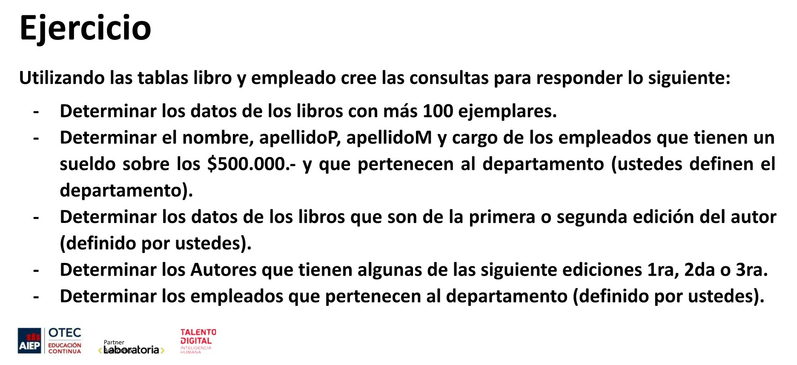

# MODULO 2 - Base de Datos | Ignacio Cavallo

---

## Clase 29 | 08-06

### Conceptos Aprendidos:

**En clase:**

1. Comando WHERE NOT IN.
2. < > Distinto.
3. Between
4. LIKE

**Fuera de Clase:**

> La verdad que estoy un poco *desmotivado*. Nos dan un ejercicio que te puede tomar **como máximo 30 minutos termina siendo unos 100 minutos o más**. El ejercicio en cuestión es el de la [Primera Parte](###primera-parte), donde se puede apreciar que son solo cinco lineas de consulta. Incluso comprendo que hay compañeros que les cueste más, pero ni siquiera lo verbalizan. Como resultado,  más de la mitad de los estudiantes no participan  ralentizando  el avance.  
> El problema es que después no hay tiempo para dar impartir todo lo propuesto en el temario. Esto pasó en el módulo 1, con  las pruebas Unitarias.
>  


### Primera Parte

Ejercicio 1:




**Resultado Primera Parte**

* Libros > 1000.

    ```sql
    SELECT * FROM Libro WHERE ejemplares>1000;
    ```

*  Sueldo > 2300 y pertenece a Brujería y Hechizos .

    ```sql
    SELECT nombre, apellidoP, apellidoM, cargo FROM empleado WHERE 
    departamento IN ('Ventas', 'Brujería y Hechizos') AND sueldo >2300;
    ```  

* Libros 1ra, 2da o 3ra y autor Mark Millar.
    ```sql
    SELECT * FROM Libro WHERE edicion IN(1,3) AND autor = 'Mark Millar';
    ```
* Autores que tengan edición 1-3.
  ```sql
  SELECT autor FROM libro WHERE edicion IN (1,2,3);
  ```
* Que empleados pertenencen a Brujería y Hechizos u Operaciones.
  ```sql
  SELECT * FROM empleado WHERE departamento IN ('Brujería y Hechizos');

  SELECT * FROM empleado WHERE departamento IN('Operaciones');
  ```


### Segunda Parte

Requerimientos:

1. Utilizar el comando WHERE NOT IN.
2. Utilizar el comando WHERE <>.
3. Utilizar el comando WHERE BETWEEN.
4. Utilizar el comando WHERE LIKE.

**Resultado Ejercicio**  

1. WHERE NOT IN:

```sql

SELECT * FROM empleado WHERE departamento NOT IN('Operaciones', 'Brujería y Hechizos');

SELECT nombre, apellidoP,  cargo FROM empleado WHERE nombre NOT IN
('Geralt', 'Walter', 'Jesse', 'Jordan');
```

2. WHERE en *<>*:

```sql
SELECT nombre, apellidoP FROM empleado WHERE cargo <> 'Vendedor';

SELECT nombre, apellidoP FROM empleado WHERE departamento <> 'Operaciones';

SELECT * FROM libro WHERE categoría <> 'Ciencia Ficción';
```

3. WHERE BETWEEN

```sql
SELECT * FROM empleado WHERE fechaIngreso BETWEEN '2008-01-01' AND '2012-12-12';

SELECT * FROM empleado WHERE sueldo BETWEEN 2500 AND 3500;

SELECT * FROM empleado WHERE fechaIngreso BETWEEN'2019-01-12' AND '2021-06-08';

SELECT * FROM Libro WHERE añoPublicacion BETWEEN '1920-12-12' AND '1985-03-16';

```
4. WHERE *LIKE*
```sql
--Termina con n ==> Tyron, Gordon, Marvin, Jordan, Gordon
SELECT * FROM empleado WHERE nombre like '%n'; 

-- Empieza con J ==> Jesse, Jordan, Jonah
SELECT * FROM empleado WHERE nombre like 'j%'; 

-- Empieza con A y termina Con N ==> 'A'lderso'n', 'A'nderso'n'
SELECT * FROM empleado WHERE apellidoP like 'a%n'; 

-- Contiene ar ==> H'ar'ry, 'Ar'thur, M'ar'vin
SELECT * FROM empleado WHERE nombre like '%ar%';

-- Contiene r en la segunda posición ==> F'r'eeman, P'r'ime, D'r'apper 
SELECT *  FROM empleado WHERE apellidoP like '_r%';

-- Empieza con d y contiene más de 3 caracteres
-- Resultado ==> Geralt De rivia, Atrhut Dent, Donald Draper
-- Excluyó ==> R2 D2(Es menor a tres caracteres.)

SELECT *  FROM empleado WHERE apellidoP like 'd___%';
```
