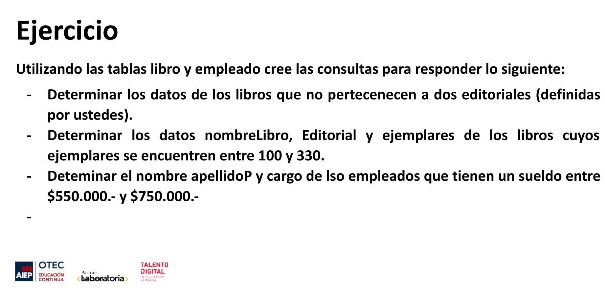

# MODULO 2 - Base de Datos | Ignacio Cavallo

---

## Clase 30 | 09-06

### Conceptos Aprendidos:

**En clase:**

1. Cláusula ORDER BY.
2. GROUP BY.
3. MAX
4. MIN
5. COUNT
6. AVG
7. SUM

**Fuera de Clase:**

> La verdad que estoy un poco *desmotivado*. Al igual que [ayer](https://github.com/cavigna/modulo_lenguaje_de_consultas_a_una_base_de_datos/blob/0d2a9a42487f58314b60dc0a9086d405df55df7f/Clase%2029__08-06/README.md),  nos dan un ejercicio que te puede tomar **como máximo 30 minutos termina siendo unos 80 minutos o más**. El ejercicio en cuestión es el de la [Primera Parte](###primera-parte), donde se puede apreciar que son solo cinco lineas de consulta. Incluso comprendo que hay compañeros que les cueste más, pero ni siquiera lo verbalizan. Como resultado,  más de la mitad de los estudiantes no participan  ralentizando  el avance.  Yo sé que el profesor tiene la mejor voluntad, pero es imprescindible que los compañeros participen o dejar de esperarlos.
> El problema es que después no hay tiempo para dar impartir todo lo propuesto en el temario. Esto pasó en el módulo 1, con  las pruebas Unitarias.
>  


### Primera Parte

Ejercicio 1:



* Determinar los datos de los libros que empiecen con la letra (letra determinada por ustedes).
* Determinar nombre, apellidoP, apellidoM, cargo, deaprtamento y edad de los empleados que no pertenecen al departamento

**Resultado Primera Parte**

* Libros != Editorial.

    ```sql
    SELECT  * FROM libro WHERE editorial NOT IN ('Pan Books', 'Destino');
    ```

* Libros > 1000 and <3000 .

    ```sql
    SELECT nombreLibro, editorial, ejemplares FROM libro 
    WHERE ejemplares BETWEEN 1000 AND 3300;
    ```  

* Libros que empiecen con E.

    ```sql
    SELECT * FROM libro WHERE nombreLibro LIKE 'e%';
    ```

* Sueldo entre 500 y 1500.

  ```sql
    SELECT nombre, apellidoP, cargo FROM empleado WHERE sueldo BETWEEN 500 AND 1500;
  ```

* Que empleados NO pertenecen a Operaciones o Finanazas.
  ```sql
    SELECT nombre, apellidoP, apellidoM, cargo, departamento, edad  
    FROM empleado WHERE departamento NOT IN ('Operaciones', 'Finanzas');
  ```


### Segunda Parte

Requerimientos:

1. Utilizar  ORDER BY.
2. Utilizar el GROUP BY, COUNT, AVG, SUM, MAX, MIN.

**Resultado Requerimientos**  

1. ORDER BY:

```sql

SELECT * FROM empleado ORDER BY apellidoP ASC; 

SELECT * FROM empleado ORDER BY apellidoP DESC;

SELECT nombre, apellidoP, cargo, sueldo FROM empleado ORDER BY sueldo DESC;

SELECT nombre, apellidoP, cargo FROM empleado ORDER BY cargo ASC;

SELECT * FROM libro ORDER BY  añoPublicacion;

SELECT nombreLibro, autor, añoPublicacion FROM libro ORDER BY  añoPublicacion DESC;

SELECT  nombreLibro, autor FROM libro ORDER BY autor;

SELECT nombreLibro FROM libro ORDER BY nombreLibro;

SELECT nombreLibro, autor FROM libro ORDER BY ejemplares DESC;
```

2. GROUP BY, COUNT, AVG, SUM, MAX, MIN:

```sql
-- Mayor Sueldo por departamento    
SELECT  nombre, apellidoP, cargo, departamento, MAX(sueldo) 
AS Sueldo_Mayor
FROM empleado 
GROUP BY departamento 
ORDER BY Sueldo_Mayor DESC;

-- Menor Sueldo por Departamento
SELECT nombre, cargo, departamento, MIN(sueldo)
AS Menor_Sueldo
FROM empleado
GROUP BY departamento
ORDER BY Menor_Sueldo;

-- Cantidad Libros por Autor
SELECT autor, COUNT(*) AS  cantidad_libros
FROM libro
GROUP BY autor
ORDER BY cantidad_libros DESC;

-- Cantidad de Libros Publicados por Año.
SELECT añoPublicacion, COUNT(añoPublicacion) AS cantidad_libros_publicados
FROM libro
GROUP BY añoPublicacion
ORDER BY añoPublicacion DESC;


--Cantidad de libros Publicados por autor
-- entre 1985 y 1999
SELECT autor, COUNT(*) 
AS  cantidad_libros
FROM libro 
WHERE añoPublicacion
BETWEEN 1985 AND 1999
GROUP BY autor
ORDER BY cantidad_libros DESC;

-- Sueldo Promedio por departamento

SELECT departamento, AVG(sueldo)
AS salario_promedio
FROM empleado
GROUP BY departamento
ORDER BY salario_promedio;

-- Suma de la cantidad de ejemplares
SELECT SUM(ejemplares) FROM Libro;

-- SUMA de ejemplares por categoría
SELECT categoria,  SUM(ejemplares) AS cantidad_categoria
FROM libro
GROUP BY categoria
ORDER BY cantidad_categoria;

-- Cantidad de Libros por categoría
SELECT categoria, COUNT(*) AS cantidad
FROM libro
GROUP BY categoria;


-- Promedio de Ejemplares por Autor
SELECT autor, AVG(ejemplares)
AS promedio
FROM libro
GROUP BY autor
ORDER BY promedio DESC;

-- Promedio edad Empresa

SELECT AVG(edad) from empleado;

-- Promedio edad por Departamento

SELECT departamento, AVG(edad)
AS promedio_edad
FROM empleado
GROUP BY departamento
ORDER BY promedio_edad DESC;

-- Mayor Edad por Departamento

SELECT nombre, apellidoP, departamento, MAX(edad)
AS viejaso
FROM empleado
GROUP BY departamento
ORDER BY viejaso DESC;

```
