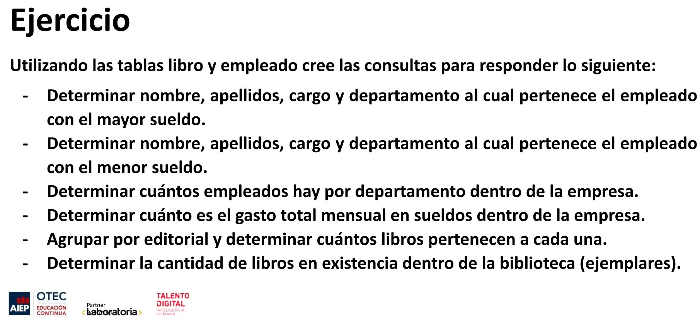
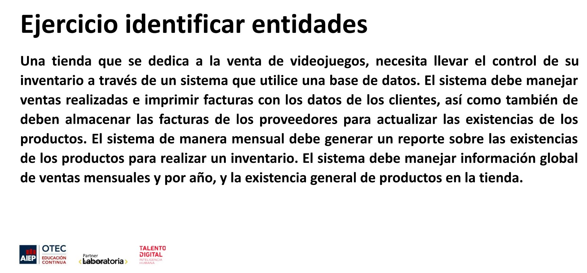
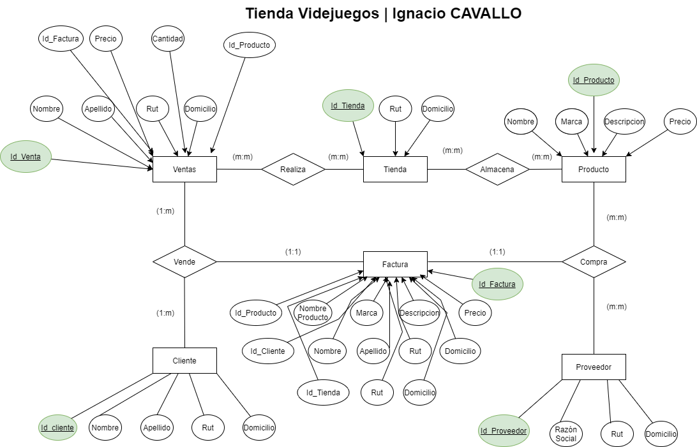

# MODULO 2 - Base de Datos | Ignacio Cavallo

---

## Clase 31 | 10-06

### Conceptos Aprendidos:

**En clase:**

1. HAVING
2. Modelo Relación Entidad.


**Fuera de Clase:**
1. Uso de draw.io
2. Búsqueda de información adicional.

### Primera Parte

Ejercicio 1:




**Resultado Primera Parte**

* Empleado con Mayor Sueldo.

    ```sql
    SELECT nombre, apellidoP, cargo, departamento, sueldo
    FROM empleado WHERE sueldo = 
    (SELECT MAX(sueldo) FROM empleado);
    ```

* Empleado Con Menor Sueldo .

    ```sql
    SELECT nombre, apellidoP, cargo, departamento, sueldo
    FROM empleado WHERE sueldo = 
    (SELECT MIN(sueldo) FROM empleado);
    ```  

* Cantidad de Empleados por Departamento.

    ```sql
    SELECT departamento, COUNT(*) 
    AS cantidad_empleados 
    FROM empleado 
    GROUP BY departamento 
    ORDER BY cantidad_empleados DESC;
  ```

* Gasto Mensual en Sueldos

  ```sql
    SELECT SUM(sueldo) AS gasto_mensual_total 
    FROM empleado;

  ```

* Cuantos Libros por Editoral.

  ```sql
    SELECT editorial, COUNT(*) AS cantidad_Libros 
    FROM libro
    GROUP BY editorial
    order by cantidad_Libros DESC;
  ```

* Ejemplares Totales.

  ```sql
    SELECT SUM(ejemplares) 
    AS cantidad_ejemplares 
    FROM libro;
  ```

### Segunda Parte



**Entidades**:

>Producto -  Clientes - Ventas - Proveedores - Facturas - Invetario

**Enunciado Adicional**:
Con el ejercicio anterior, usando las entidades identificadas, establecer su relación, su tipo de correspondencia
(uno a uno, uno a muchos o muchos a muchos) y sus atributos o campos.

**Resultado**:


Solo quiero aclarar que las relaciones uno a uno de las facturas se debe a que por transacción(compra o venta), solo se genera una factura por cliente o por proveedor.
 