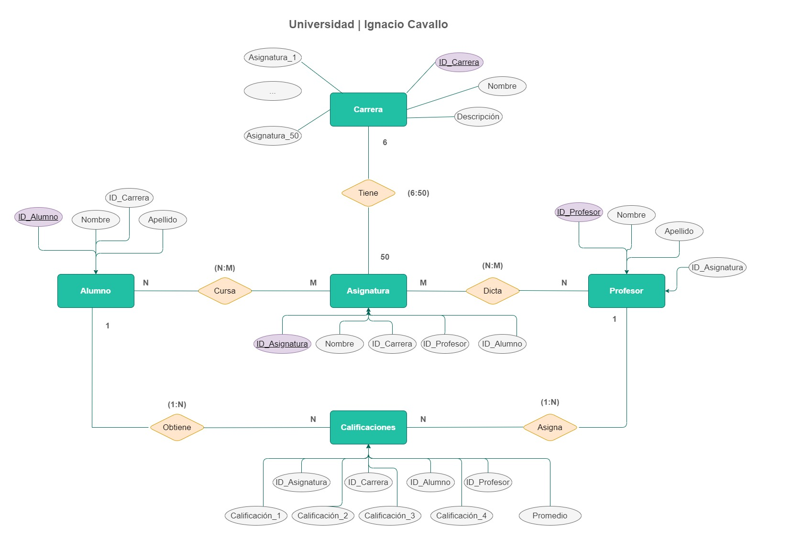
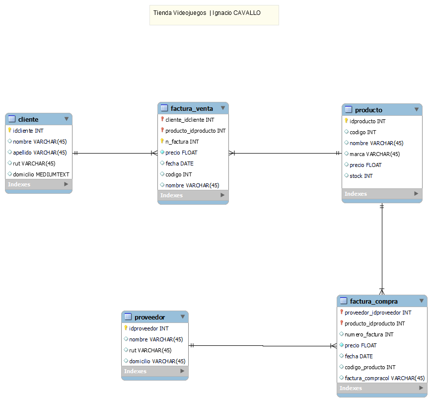

# MODULO 2 - Base de Datos | Ignacio Cavallo

---

## Clase 33 | 14-06

Aprendimos como usar Workbench, para realizar diagramas entidad relación, y poder exportarlos al modelo.
Se nos requirió que pasáramos los ejercicios anteriores

### Primera Parte

Terminamos los ejercicios que realizamos la clase pasada.


### Segunda Parte

Como aprendimos como diagramar en Workbench, usando lo anterior, comenzamos a modelar.



Acá está el código de SQL generado por workbench:

```sql
-- MySQL Workbench Forward Engineering

SET @OLD_UNIQUE_CHECKS=@@UNIQUE_CHECKS, UNIQUE_CHECKS=0;
SET @OLD_FOREIGN_KEY_CHECKS=@@FOREIGN_KEY_CHECKS, FOREIGN_KEY_CHECKS=0;
SET @OLD_SQL_MODE=@@SQL_MODE, SQL_MODE='ONLY_FULL_GROUP_BY,STRICT_TRANS_TABLES,NO_ZERO_IN_DATE,NO_ZERO_DATE,ERROR_FOR_DIVISION_BY_ZERO,NO_ENGINE_SUBSTITUTION';

-- -----------------------------------------------------
-- Schema videojuegos
-- -----------------------------------------------------

-- -----------------------------------------------------
-- Schema videojuegos
-- -----------------------------------------------------
CREATE SCHEMA IF NOT EXISTS `videojuegos` DEFAULT CHARACTER SET utf8 ;
USE `videojuegos` ;

-- -----------------------------------------------------
-- Table `videojuegos`.`producto`
-- -----------------------------------------------------
CREATE TABLE IF NOT EXISTS `videojuegos`.`producto` (
  `idproducto` INT NOT NULL,
  `codigo` INT NULL,
  `nombre` VARCHAR(45) NULL,
  `marca` VARCHAR(45) NULL,
  `precio` FLOAT NULL,
  `stock` INT NULL,
  PRIMARY KEY (`idproducto`))
ENGINE = InnoDB;


-- -----------------------------------------------------
-- Table `videojuegos`.`cliente`
-- -----------------------------------------------------
CREATE TABLE IF NOT EXISTS `videojuegos`.`cliente` (
  `idcliente` INT NOT NULL,
  `nombre` VARCHAR(45) NULL,
  `apellido` VARCHAR(45) NULL,
  `rut` VARCHAR(45) NULL,
  `domicilio` MEDIUMTEXT NULL,
  PRIMARY KEY (`idcliente`))
ENGINE = InnoDB;


-- -----------------------------------------------------
-- Table `videojuegos`.`factura_venta`
-- -----------------------------------------------------
CREATE TABLE IF NOT EXISTS `videojuegos`.`factura_venta` (
  `cliente_idcliente` INT NOT NULL,
  `producto_idproducto` INT NOT NULL,
  `n_factura` INT NOT NULL,
  `precio` FLOAT NOT NULL,
  `fecha` DATE NULL,
  `codigo` INT NULL,
  `nombre` VARCHAR(45) NULL,
  PRIMARY KEY (`cliente_idcliente`, `producto_idproducto`, `n_factura`),
  INDEX `fk_cliente_has_producto_producto1_idx` (`producto_idproducto` ASC) VISIBLE,
  INDEX `fk_cliente_has_producto_cliente_idx` (`cliente_idcliente` ASC) VISIBLE,
  CONSTRAINT `fk_cliente_has_producto_cliente`
    FOREIGN KEY (`cliente_idcliente`)
    REFERENCES `videojuegos`.`cliente` (`idcliente`)
    ON DELETE NO ACTION
    ON UPDATE NO ACTION,
  CONSTRAINT `fk_cliente_has_producto_producto1`
    FOREIGN KEY (`producto_idproducto`)
    REFERENCES `videojuegos`.`producto` (`idproducto`)
    ON DELETE NO ACTION
    ON UPDATE NO ACTION)
ENGINE = InnoDB;


-- -----------------------------------------------------
-- Table `videojuegos`.`proveedor`
-- -----------------------------------------------------
CREATE TABLE IF NOT EXISTS `videojuegos`.`proveedor` (
  `idproveedor` INT NOT NULL,
  `nombre` VARCHAR(45) NULL,
  `rut` VARCHAR(45) NULL,
  `domicilio` VARCHAR(45) NULL,
  PRIMARY KEY (`idproveedor`))
ENGINE = InnoDB;


-- -----------------------------------------------------
-- Table `videojuegos`.`factura_compra`
-- -----------------------------------------------------
CREATE TABLE IF NOT EXISTS `videojuegos`.`factura_compra` (
  `proveedor_idproveedor` INT NOT NULL,
  `producto_idproducto` INT NOT NULL,
  `numero_factura` INT NULL,
  `precio` FLOAT NOT NULL,
  `fecha` DATE NULL,
  `codigo_producto` INT NULL,
  `factura_compracol` VARCHAR(45) NULL,
  PRIMARY KEY (`proveedor_idproveedor`, `producto_idproducto`),
  INDEX `fk_proveedor_has_producto_producto1_idx` (`producto_idproducto` ASC) VISIBLE,
  INDEX `fk_proveedor_has_producto_proveedor1_idx` (`proveedor_idproveedor` ASC) VISIBLE,
  CONSTRAINT `fk_proveedor_has_producto_proveedor1`
    FOREIGN KEY (`proveedor_idproveedor`)
    REFERENCES `videojuegos`.`proveedor` (`idproveedor`)
    ON DELETE NO ACTION
    ON UPDATE NO ACTION,
  CONSTRAINT `fk_proveedor_has_producto_producto1`
    FOREIGN KEY (`producto_idproducto`)
    REFERENCES `videojuegos`.`producto` (`idproducto`)
    ON DELETE NO ACTION
    ON UPDATE NO ACTION)
ENGINE = InnoDB;


SET SQL_MODE=@OLD_SQL_MODE;
SET FOREIGN_KEY_CHECKS=@OLD_FOREIGN_KEY_CHECKS;
SET UNIQUE_CHECKS=@OLD_UNIQUE_CHECKS;
```
