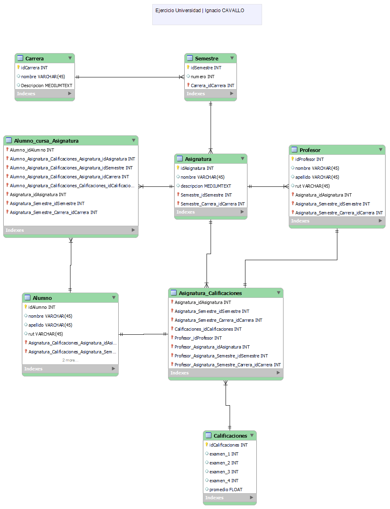

# MODULO 2 - Base de Datos | Ignacio Cavallo

---

## Clase 34 | 15-06

Aprendimos como usar Workbench, para realizar diagramas entidad relación, y poder exportarlos al modelo.
Se nos requirió que pasáramos los ejercicios anteriores

### Primera Parte

Terminamos los ejercicios que realizamos la clase pasada.


### Segunda Parte

#### Views 

```sql
CREATE VIEW vista AS
SELECT columna1, columna2, ...
FROM tabla
WHERE condición;

CREATE VIEW datosPersonales AS 
SELECT nombre, apellidoP, edad 
FROM empleado
WHERE sueldo>1500;
```

#### Subconsutla

```SQL
SELECT * FROM tabla
WHERE condición
(SELECT selección
FROM tabla)

-- Sueldos mayores al promedio de la empresa
SELECT * FROM empleado
WHERE sueldo >
(SELECT AVG(sueldo) FROM  empleado);

SELECT * FROM empleado WHERE sueldo>all
(SELECT sueldo FROM  empleado WHERE departamento="Ventas");

```

``` SQL
SELECT columna(s)
FROM tabla1
INNER JOIN tabla2
ON tabla1.columna = tabla2.columna;

SELECT * 
FROM producto
INNER JOIN factura_venta
ON producto.precio = factura_venta.precio;

```