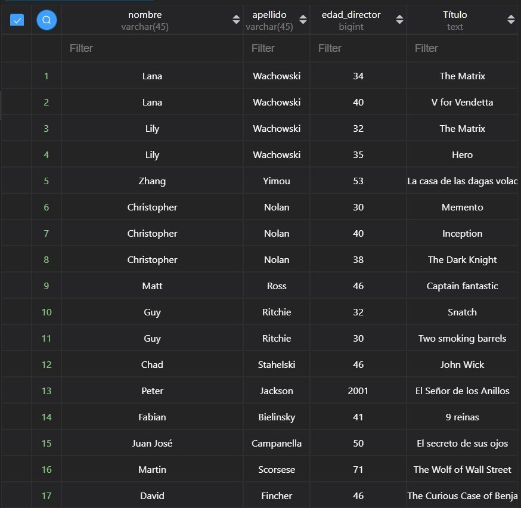
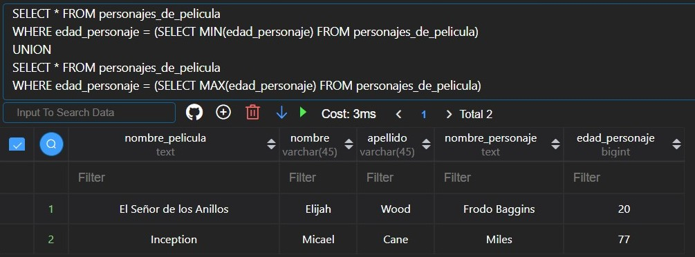

# MODULO 2 - Base de Datos | EXAMEN | Ignacio Cavallo

---
## Comentarios
Esta entrega se divide en los dos ejercicios que fueron suministrados. El pedido por el profesor en clases, más
el que está en la plataforma.  
Aclaraciones:

1. TODO el [script](##script) está al final del documento.:arrow_double_down:

2. Se desarrolló tanto el [*ejercicio del profesor*](##ejercicio-1) como también el que se encuentra en la [*plataforma*](##ejercicio-2).:two:

3. Hice muchas consultas que no están especificadas en este README, pero si están al final.:arrow_heading_down:

4. Todos los pasos en el desarrollo del esquema están en mi repositorio sobre este módulo.:signal_strength:

5. Al ser un documento *demasiado* extenso, me tomé la libertad de mostrar primero las consultas más avanzadas. Es por ello que JOIN está listada como 0.:thinking:

6. En el apartado de JOIN puedo demostrar lo aprendido en clase junto a otros conceptos como DATEDIFF ó UNION. :nerd_face:

7. Espero que sea al menos entretenida esta lectura.**Muchas Gracias por su tiempo y *que le sea leve!***:sweat_smile:


## EJERCICIO 1


### Problemática

Una de mis pasiones es el entretenimiento audio visual, por eso decidí hacer una pequeña base de datos que contenga
algunas de mis películas favoritas.  
Básicamente voy a implementar mi propio IMDB (*Ignacio* Movie Data Base).:wink:  
</br>
Por ende consideré las siguientes entidades:

* Película
* Actor
* Director
* Género
* Critica

Con estas entidades, es hora de ver las relaciones que existen entre ellas:

* Un actor puede estar en muchas películas como también muchos actores pueden estar en muchas películas.

>       Actor <==> Películas  

* Una película puede ser dirigida por múltiples directores, como también un director dirige muchas películas.

>       Director <==> Películas
  
* El género de una película puede ser más de uno(Comedia Dramática) y todas las películas tienen género.

>       Género <==> Películas

* Por último, una película tiene criticas, y a su vez hay muchos críticos que califican a muchas películas.

>       Critica <==> Películas

### 1. MODELO ENTIDAD-RELACIÓN


Entonces, considerando lo anterior, al tener todas entidades con relaciones muchos a muchos **N:M**, se nos generaran las siguientes tablas intermedias:

Un actor que desempeña un rol en un film, se convierte en un personaje, por ende:

>       Actor ==> Personaje <== Películas  

Una película con un director tiene una dirección:

>       Director ==> Dirección <== Películas  

Una película tiene muchos géneros:

>       Genero ==> Género de Película <== Películas  

Un critico al calificar una película, brinda un Puntaje:
>       Crítico ==> Puntaje <== Películas  
---

### 2. MODELO RELACIONAL

  

---

### 3. SCRIPT

El script está al final del documento!.  

---

### 4. CONSULTAS

Con el fin de contextualizar, mostraré como está el esquema de mi base de datos.

</br>
En este apartado mostraré diferentes querys con la siguiente estructura:

>**COMANDO | CLAUSULA**
>
>**DESCRIPCION**
>
>**QUERY** en formato de código.
>
>**RESUTADO** en formato de imagen.

#### 0. JOIN | WHERE | HAVING | GROUP BY |

Al tener tablas intermedias, estamos obligados a usar join, para poder relacionar las
entidades que se definieron en el modelo. A continuación veremos varios ejemplos interesantes
en los que se aplica todo lo aprendido en clase, más algunos conceptos que aprendí por mi cuenta. 
Por ejemplo, calcular la edad en función a una fecha, calcular la edad de un actor con respecto a
la fecha de estreno, aplicar redondeo a un promedio, entre otras.

##### DESCRIPCIÓN  

> Mostrar todas las películas de *acción*,

##### QUERY

``` sql
SELECT 
        p.nombre
FROM
    pelicula p
        INNER  JOIN
    genero_pelicula gp ON p.idPelicula = gp.idPelicula
         inner JOIN
    genero g ON g.idGenero = gp.idGenero
    
    WHERE g.genero = 'Acción';

```

##### RESULTADO


##### DESCRIPCIÓN  

> Mostrar todas las películas con sus puntajes disgregados por Crítico.  
> Agregar una columna que muestre el promedio de los tres críticos

##### QUERY

``` sql
SELECT 
    pelicula.nombre,
    imdb.calificacion AS IMDB,
    ff.calificacion AS Film_Affinity,
    ic.calificacion AS Ignacio_Cavallo,
    ROUND((imdb.calificacion + ff.calificacion + ic.calificacion)/3.0,2) as Promedio
FROM
    pelicula
        INNER JOIN
    puntaje imdb ON pelicula.idPelicula = imdb.idPelicula
        INNER JOIN
    puntaje ff ON pelicula.idPelicula = ff.idPelicula
        AND ff.idCritico = 2
        INNER JOIN
    puntaje ic ON pelicula.idPelicula = ic.idPelicula
        AND ic.idCritico = 3
GROUP BY pelicula.idPelicula;
```

##### RESULTADO


##### DESCRIPCIÓN  

> Mostrar el elenco y sus personajes de *Matrix*

##### QUERY

``` sql
SELECT actor.nombre, actor.apellido, personaje.nombre_personaje
FROM
    actor
        INNER JOIN
    personaje ON actor.idActor = personaje.idActor
        JOIN 
    pelicula ON pelicula.idPelicula = personaje.idPelicula
    WHERE pelicula.nombre = 'The Matrix';
```

##### RESULTADO


##### DESCRIPCIÓN  

> Mostrar aquellos directores que tengan *más de una* película.

##### QUERY

``` sql
SELECT 
    director.nombre,
    director.apellido,
    COUNT(direccion.idDirector) AS cantidad_peliculas
FROM
    director
        INNER JOIN
    direccion ON director.idDirector = direccion.idDirector
GROUP BY director.nombre , director.apellido
HAVING cantidad_peliculas > 1;
```

##### RESULTADO


#### 1. SELECT

##### DESCRIPCIÓN  

Mostrar todos los valores, de película, actor y director

##### QUERY

``` sql
SELECT * FROM pelicula; 
SELECT * FROM actor;
SELECT * FROM director;
```

##### RESULTADO


#### 2. UPDATE
Como vemos me equivoqué al cargar algunos campos, vamos a modificarlos:

##### DESCRIPCIÓN  

Cambiar el nombre de *"El seños de los anillos"* por *'El Señor de los Anillos'*

##### QUERY

``` sql
SELECT * FROM pelicula
WHERE pelicula.idPelicula=9;
UPDATE pelicula
SET nombre = 'El Señor de los Anillos'
WHERE pelicula.idPelicula=9;
```

##### RESULTADO


#### 3. WHERE + CONDICIÓN

Algunas búsquedas con condiciones.

##### DESCRIPCIÓN  

>Buscar todos los nombres de películas que *NO* sean de Estados Unidos ó Inglaterra.

##### QUERY

``` sql
SELECT nombre, pais FROM pelicula
WHERE pais NOT IN ('USA', 'UK');
```

##### RESULTADO


##### DESCRIPCIÓN  

>Mostrar nombre y apellido de todas las *ACTRICES* excluyendo a los hombres

##### QUERY

``` sql
SELECT nombre, apellido FROM actor
WHERE genero <> 'm';
```

##### RESULTADO


##### DESCRIPCIÓN  

> Mostrar nombre y apellido de todos los actores cuyos nombres comiencen con 'J'
> y contengan al menos tres caracteres después de la j.

##### QUERY

``` sql
SELECT nombre, apellido FROM actor
WHERE nombre LIKE 'j___%';
```

##### RESULTADO

  

#### 4. GROUP BY | ORDER BY

Algunas búsquedas agrupadas y ordenadas.

##### DESCRIPCIÓN  

> Cuantas películas por país.

##### QUERY

``` sql
SELECT pais, COUNT(*) AS cantidad
FROM pelicula
GROUP BY pais;
```

##### RESULTADO


##### DESCRIPCIÓN  

> Ingresos por país por año, ordenado por país

##### QUERY

```sql
SELECT pais, año, SUM(recaudacion) as Recaudación
FROM pelicula
GROUP BY año
ORDER BY pais;
```

##### RESULTADO


#### 5. SUB QUERY

Algunos ejemplos de SubQuery

##### DESCRIPCIÓN  

> Mostrar la película con la *MAYOR*  recaudación

##### QUERY

``` sql
SELECT nombre
FROM pelicula
WHERE recaudacion = 
(SELECT MAX(recaudacion) FROM pelicula);
```

##### RESULTADO


##### DESCRIPCIÓN  

> Mostrar la película con la *MENOR*  recaudación

##### QUERY

``` sql
SELECT nombre
FROM pelicula
WHERE recaudacion = 
(SELECT MIN(recaudacion) FROM pelicula);
```

##### RESULTADO


Algunas búsquedas con condiciones.

##### DESCRIPCIÓN  

> Mostrar todas aquellas películas cuyo ingreso fué mayor al *promedio*
> de recaudaciones generales.

##### QUERY

``` sql
SELECT nombre
FROM pelicula
WHERE recaudacion > 
(SELECT AVG(recaudacion) FROM pelicula);
```

##### RESULTADO


#### 6. VIEWS

A mi parecer, a algunas de las tablas podrían tener información que a priori no parecía relevante.
Por ejemplo, calcular la edad de los actores/directores, cuando filmaron la película.
Por ello consideré crear las siguientes vistas: 

##### DESCRIPCIÓN  

> Vista Personaje con su respectivo nombre, apellido, nombre del personaje y la edad del personaje.
> Vista Director con su respectivo nombre, apellido, nombre del personaje y la edad del director cuando filmó la película.

##### QUERY

``` sql
CREATE VIEW Personajes_de_Pelicula AS
SELECT 
    pelicula.nombre AS nombre_pelicula,
    actor.nombre,
    actor.apellido,
    personaje.nombre_personaje,
    pelicula.año -YEAR(actor.fecha_nacimiento) AS edad_personaje
FROM
    actor
        INNER JOIN
    personaje ON actor.idActor = personaje.idActor
        JOIN
    pelicula ON pelicula.idPelicula = personaje.idPelicula
ORDER BY pelicula.nombre;

CREATE VIEW directores_de_peliculas AS
SELECT 
    director.nombre, 
    director.apellido, 
    pelicula.año - YEAR(director.fecha_nacimiento) as edad_director,
    pelicula.nombre as Título
FROM 
    director
        INNER JOIN
    direccion ON director.idDirector = direccion.idDirector
        INNER JOIN
    pelicula ON pelicula.idPelicula =direccion.idPelicula;
```

##### RESULTADO





##### DESCRIPCIÓN  

> Mostrar el personaje con *MENOR EDAD* a la hora de filmar. 
> Mostrar el personaje con *MAYOR EDAD* a la hora de filmar.

##### QUERY

``` sql
SELECT * FROM personajes_de_pelicula
WHERE edad_personaje = (SELECT MIN(edad_personaje) FROM personajes_de_pelicula)
UNION 
SELECT * FROM personajes_de_pelicula
WHERE edad_personaje = (SELECT MAX(edad_personaje) FROM personajes_de_pelicula);

```

##### RESULTADO




--- 

## EJERCICIO 2


```SQL
CREATE DATABASE examen CHARACTER SET utf8;

USE examen;
CREATE TABLE producto (
    idproducto INT NOT NULL AUTO_INCREMENT,
    nombre VARCHAR(45),
    descripcion TEXT,
    precio INT,
    stock INT,
    PRIMARY KEY (idproducto));

INSERT INTO producto(nombre, descripcion, precio, stock)
VALUES('Camiseta', 'Camiseta negra simple de talla única', 10,16),
    ('Pantalón', 'Pantalón largo azul tipo chino', 20,24),
    ('Gorra', 'Gorra azul con el logo de los Yankees', 15, 32),
    ('Zapatillas', 'Zapatillas de running de color blanco y verde', 35, 13);

--1.- Recuperar TODOS los datos de la tabla Productos (sin condición)
SELECT * FROM producto;

-- Recuperar los datos de la fila donde  el nombre del producto sea “Camiseta”.

SELECT * FROM producto WHERE nombre='Camiseta';

-- Recuperar los datos de las filas donde Stock sea menor que 20
SELECT * FROM producto WHERE stock<20;

-- Recuperar los datos de la fila con ProductoID 3
SELECT * FROM producto WHERE idproducto = 3;

-- Eliminar las filas de productos donde el stock sea mayor o igual a 20
SELECT * FROM producto WHERE stock >=20;

```

## SCRIPT

A continuación dejo el script **COMPLETO** de mi trabajo. Esto incluye:

1. Generación de Schema.

2. TODOS los datos para ser cargados en la base de datos.

3. TODAS las consultas que están este documento.

4. TODAS las consultas que hice. Es decir, las del anterior punto junto a otras que decidí no agregar para no hacer muy largo este documento.  

```sql
------------------------------------------------------------
------------------------------------------------------------
------------------------------------------------------------

-- -----------------------------------------------------
--                      SCRIPT
-- -----------------------------------------------------

------------------------------------------------------------
------------------------------------------------------------
------------------------------------------------------------


-- MySQL Workbench Forward Engineering

SET @OLD_UNIQUE_CHECKS=@@UNIQUE_CHECKS, UNIQUE_CHECKS=0;
SET @OLD_FOREIGN_KEY_CHECKS=@@FOREIGN_KEY_CHECKS, FOREIGN_KEY_CHECKS=0;
SET @OLD_SQL_MODE=@@SQL_MODE, SQL_MODE='ONLY_FULL_GROUP_BY,STRICT_TRANS_TABLES,NO_ZERO_IN_DATE,NO_ZERO_DATE,ERROR_FOR_DIVISION_BY_ZERO,NO_ENGINE_SUBSTITUTION';

-- -----------------------------------------------------
-- Schema movies
-- -----------------------------------------------------

-- -----------------------------------------------------
-- Schema movies
-- -----------------------------------------------------
CREATE SCHEMA IF NOT EXISTS `movies` DEFAULT CHARACTER SET utf8 ;
USE `movies` ;

-- -----------------------------------------------------
-- Table `movies`.`Actor`
-- -----------------------------------------------------
CREATE TABLE IF NOT EXISTS `movies`.`Actor` (
  `idActor` INT NOT NULL AUTO_INCREMENT,
  `nombre` VARCHAR(45) NULL,
  `apellido` VARCHAR(45) NULL,
  `fecha_nacimiento` DATE NULL,
  `genero` VARCHAR(1) NULL,
  `pais` VARCHAR(45) NULL,
  PRIMARY KEY (`idActor`))
ENGINE = InnoDB;


-- -----------------------------------------------------
-- Table `movies`.`Director`
-- -----------------------------------------------------
CREATE TABLE IF NOT EXISTS `movies`.`Director` (
  `idDirector` INT NOT NULL AUTO_INCREMENT,
  `nombre` VARCHAR(45) NULL,
  `apellido` VARCHAR(45) NULL,
  `fecha_nacimiento` DATE NULL,
  `genero` VARCHAR(45) NULL,
  `pais` VARCHAR(45) NULL,
  PRIMARY KEY (`idDirector`))
ENGINE = InnoDB;


-- -----------------------------------------------------
-- Table `movies`.`Critico`
-- -----------------------------------------------------
CREATE TABLE IF NOT EXISTS `movies`.`Critico` (
  `idCritico` INT NOT NULL AUTO_INCREMENT,
  `nombre` VARCHAR(45) NULL,
  PRIMARY KEY (`idCritico`))
ENGINE = InnoDB;


-- -----------------------------------------------------
-- Table `movies`.`Pelicula`
-- -----------------------------------------------------
CREATE TABLE IF NOT EXISTS `movies`.`Pelicula` (
  `idPelicula` INT NOT NULL AUTO_INCREMENT,
  `nombre` TEXT NULL,
  `año` INT NULL,
  `duracion` INT NULL,
  `presupuesto` INT NULL,
  `recaudacion` INT NULL,
  `idioma` TEXT NULL,
  `pais` TEXT NULL,
  PRIMARY KEY (`idPelicula`))
ENGINE = InnoDB;


-- -----------------------------------------------------
-- Table `movies`.`Genero`
-- -----------------------------------------------------
CREATE TABLE IF NOT EXISTS `movies`.`Genero` (
  `idGenero` INT NOT NULL AUTO_INCREMENT,
  `genero` VARCHAR(45) NULL,
  PRIMARY KEY (`idGenero`))
ENGINE = InnoDB;


-- -----------------------------------------------------
-- Table `movies`.`Personaje`
-- -----------------------------------------------------
CREATE TABLE IF NOT EXISTS `movies`.`Personaje` (
  `idPelicula` INT NOT NULL,
  `idActor` INT NOT NULL,
  `nombre_personaje` TEXT NULL,
  PRIMARY KEY (`idPelicula`, `idActor`),
  INDEX `fk_Pelicula_has_Actor_Actor1_idx` (`idActor` ASC) VISIBLE,
  INDEX `fk_Pelicula_has_Actor_Pelicula_idx` (`idPelicula` ASC) VISIBLE,
  CONSTRAINT `fk_Pelicula_has_Actor_Pelicula`
    FOREIGN KEY (`idPelicula`)
    REFERENCES `movies`.`Pelicula` (`idPelicula`)
    ON DELETE NO ACTION
    ON UPDATE NO ACTION,
  CONSTRAINT `fk_Pelicula_has_Actor_Actor1`
    FOREIGN KEY (`idActor`)
    REFERENCES `movies`.`Actor` (`idActor`)
    ON DELETE NO ACTION
    ON UPDATE NO ACTION)
ENGINE = InnoDB;


-- -----------------------------------------------------
-- Table `movies`.`Direccion`
-- -----------------------------------------------------
CREATE TABLE IF NOT EXISTS `movies`.`Direccion` (
  `idPelicula` INT NOT NULL,
  `idDirector` INT NOT NULL,
  PRIMARY KEY (`idPelicula`, `idDirector`),
  INDEX `fk_Pelicula_has_Director_Director1_idx` (`idDirector` ASC) VISIBLE,
  INDEX `fk_Pelicula_has_Director_Pelicula1_idx` (`idPelicula` ASC) VISIBLE,
  CONSTRAINT `fk_Pelicula_has_Director_Pelicula1`
    FOREIGN KEY (`idPelicula`)
    REFERENCES `movies`.`Pelicula` (`idPelicula`)
    ON DELETE NO ACTION
    ON UPDATE NO ACTION,
  CONSTRAINT `fk_Pelicula_has_Director_Director1`
    FOREIGN KEY (`idDirector`)
    REFERENCES `movies`.`Director` (`idDirector`)
    ON DELETE NO ACTION
    ON UPDATE NO ACTION)
ENGINE = InnoDB;


-- -----------------------------------------------------
-- Table `movies`.`Puntaje`
-- -----------------------------------------------------
CREATE TABLE IF NOT EXISTS `movies`.`Puntaje` (
  `idCritico` INT NOT NULL,
  `idPelicula` INT NOT NULL,
  `calificacion` FLOAT NULL,
  PRIMARY KEY (`idCritico`, `idPelicula`),
  INDEX `fk_Critico_has_Pelicula_Pelicula1_idx` (`idPelicula` ASC) VISIBLE,
  INDEX `fk_Critico_has_Pelicula_Critico1_idx` (`idCritico` ASC) VISIBLE,
  CONSTRAINT `fk_Critico_has_Pelicula_Critico1`
    FOREIGN KEY (`idCritico`)
    REFERENCES `movies`.`Critico` (`idCritico`)
    ON DELETE NO ACTION
    ON UPDATE NO ACTION,
  CONSTRAINT `fk_Critico_has_Pelicula_Pelicula1`
    FOREIGN KEY (`idPelicula`)
    REFERENCES `movies`.`Pelicula` (`idPelicula`)
    ON DELETE NO ACTION
    ON UPDATE NO ACTION)
ENGINE = InnoDB;


-- -----------------------------------------------------
-- Table `movies`.`Genero_Pelicula`
-- -----------------------------------------------------
CREATE TABLE IF NOT EXISTS `movies`.`Genero_Pelicula` (
  `idPelicula` INT NOT NULL,
  `idGenero` INT NOT NULL,
  PRIMARY KEY (`idPelicula`, `idGenero`),
  INDEX `fk_Pelicula_has_Genero_Genero1_idx` (`idGenero` ASC) VISIBLE,
  INDEX `fk_Pelicula_has_Genero_Pelicula1_idx` (`idPelicula` ASC) VISIBLE,
  CONSTRAINT `fk_Pelicula_has_Genero_Pelicula1`
    FOREIGN KEY (`idPelicula`)
    REFERENCES `movies`.`Pelicula` (`idPelicula`)
    ON DELETE NO ACTION
    ON UPDATE NO ACTION,
  CONSTRAINT `fk_Pelicula_has_Genero_Genero1`
    FOREIGN KEY (`idGenero`)
    REFERENCES `movies`.`Genero` (`idGenero`)
    ON DELETE NO ACTION
    ON UPDATE NO ACTION)
ENGINE = InnoDB;


SET SQL_MODE=@OLD_SQL_MODE;
SET FOREIGN_KEY_CHECKS=@OLD_FOREIGN_KEY_CHECKS;
SET UNIQUE_CHECKS=@OLD_UNIQUE_CHECKS;


------------------------------------------------------------
------------------------------------------------------------
------------------------------------------------------------

-- -----------------------------------------------------
--                      DATOS DE LA BASE
-- -----------------------------------------------------

------------------------------------------------------------
------------------------------------------------------------
------------------------------------------------------------


--Peliculas
INSERT INTO pelicula(nombre, año, duracion, presupuesto, recaudacion, idioma, pais)
VALUES
('The Matrix', 1999, 138, 63000000, 465000000, 'Ingles', 'USA'),
('Hero', 2002, 119,	85000000, 29980000,	'Chino', 'China'),
('Memento',	2000, 113, 90000000, 39723096, 'Ingles',	'USA'),
('Captain fantastic',2016, 118,	5000000, 22000000, 'Ingles', 'USA'),
('Inception', 2010, 148, 160000000, 825532764, 'Ingles', 'USA'),
('Snatch',	2000, 99, 10000000, 83600000, 'Ingles', 'UK'),
('Two smoking barrels',	1998, 105, 1400000, 28000000, 'Ingles', 'UK'),
('John Wick', 2014, 114, 20000000, 86013268, 'Ingles', 'USA'),
('El señor de los anillos', 2001, 178, 93000000, 870761744, 'Ingles', 'NZ'),
('9 reinas', 2000, 115, 1300000, 12413888, 'Español', 'Argentina'),
('El secreto de sus ojos', 2009, 129, 2000000, 35079650, 'Español',	'Argentina'),
('The Dark Knight',	2008, 152, 185000000, 1004558444,'Ingles','UK'),
('V for Vendetta', 2005, 132, 54000000, 425511035, 'Ingles', 'USA'),
('La casa de las dagas voladoras', 2004, 119, 30000000, 50000000, 'Chino', 'China'),
('The Wolf of Wall Street', 2013, 180, 100000000, 392000694, 'Ingles', 'USA'),
('The Curious Case of Benjamin Button', 2008, 116, 150000000, 333932083, 'Ingles','USA'),
('What We Do In The Shadows', 2014, 86, 1600000, 7253160, 'Ingles', 'NZ');

-- Director
INSERT INTO director(nombre, apellido, fecha_nacimiento, genero, pais)
VALUES
('Lana', 'Wachowski', '1965-04-21', 'f', 'USA'),
('Lily', 'Wachowski', '1967-12-29', 'f', 'USA'),
('Zhang', 'Yimou', '1951-11-14', 'm', 'China'),
('Christopher', 'Nolan', '1970-07-30', 'm', 'UK'),
('Matt', 'Ross', '1970-01-03', 'm', 'USA'),
('Guy', 'Ritchie', '1968-09-10', 'm', 'UK'),
('Chad', 'Stahelski', '1968-09-20', 'm', 'USA'),
('Peter', 'Jackson', '1961-10-31', 'm', 'NZ'),
('Fabian', 'Bielinsky', '1959-02-03','m', 'Argentina'),
('Juan José', 'Campanella', '1959-07-19', 'm', 'Argentina'),
('Martin', 'Scorsese', '1942-11-17','m', 'USA'),
('David', 'Fincher', '1962-08-28', 'm', 'USA'),
('Taika', 'Waititi', '1975-08-16', 'm', 'NZ'),
('Jemaine', 'Clement', '1974-01-10', 'm', 'NZ');

--Actor/Actriz
INSERT INTO actor(nombre, apellido, fecha_nacimiento, genero, pais)
VALUES
    ('Ricardo', 'Darin', '1957-01-16', 'm', 'Argentina'),
    ('Gastón', 'Pauls', '1972-01-17', 'm', 'Argentina'),
    ('Guillermo', 'Francella', '1955-02-14', 'm', 'Argentina'),
    ('Keanu', 'Reves', '1964-09-02', 'm', 'USA'),
    ('Carrie-Anne', 'Moss','1967-08-21', 'f', 'Canada'),
    ('Viggo', 'Mortensen', '1958-10-20', 'm','USA'),
    ('Jet', 'Li', '1963-04-26', 'm', 'China'),
    ('Guy', 'Pearce', '1967-10-05', 'm', 'UK'),
    ('Joe', 'Pantoliano', '1951-09-12', 'm','USA'),
    ('Leonardo', 'DiCaprio','1974-11-11', 'm','USA'),
    ('Jason', 'Statham', '1966-07-26', 'm', 'UK'),
    ('Micael', 'Cane', '1933-03-14', 'm', 'UK'),
    ('Hugo', 'Weaving','1960-04-04', 'm', 'UK'),
    ('Elijah', 'Wood', '1981-01-28', 'm','USA'),
    ('Brad', 'Pitt', '1963-12-17', 'm','USA'),
    ('Christian', 'Bale', '1974-01-30', 'm', 'UK'),
    ('Ziyi', 'Zhang', '1979-02-09', 'f', 'China'),
    ('Natalie', 'Portman', '1981-07-09', 'f', 'USA'),
    ('Cate', 'Blanchet', '1969-05-14', 'f', 'Australia'),
    ('Taika', 'Waititi', '1975-08-16', 'm', 'NZ'),
    ('Jemaine', 'Clement', '1974-01-10', 'm', 'NZ');

--Criticos
INSERT INTO critico(nombre)
VALUES
    ('IMDB'),
    ('Film Affinity'),
    ('Ignacio Cavallo');

--Calificación por película
INSERT INTO puntaje(idPelicula, idCritico, calificacion)
VALUES 
(1, 1, 8.7),  (1, 2, 7.9), (1, 3, 8.5), 
(2, 1, 7.9),  (2, 2, 7.3), (2, 3, 8.2),
(3, 1, 7.4),  (3, 2, 7.9), (3, 3, 9.0),
(4, 1, 7.9),  (4, 2, 7.5), (4, 3, 8.7),
(5, 1, 8.8),  (5, 2, 8.0), (5, 3, 8.8),
(6, 1, 8.3),  (6, 2, 7.9), (6, 3, 9.0),
(7, 1, 8.2),  (7, 2, 7.8), (7, 3, 7.2),
(8, 1, 7.4),  (8, 2, 6.3), (8, 3, 6.3),
(9, 1, 8.8),  (9, 2, 8.0), (9, 3, 8.1),
(10, 1, 7.9), (10, 2, 7.8), (10, 3, 8.2),
(11, 1, 8.2), (11, 2, 8.1), (11, 3, 8.4),
(12, 1, 9.0), (12, 2, 8.1), (12, 3, 9.2),
(13, 1, 8.1), (13, 2, 7.5), (13, 3, 6.6),
(14, 1, 6.9), (14, 2, 7.0), (14, 3, 5.9),
(15, 1, 8.2), (15, 2, 7.6), (15, 3, 8.1),
(16, 1, 7.8), (16, 2, 7.2), (16, 3, 7.9),
(17, 1, 7.7), (17, 2, 6.8), (17, 3, 7.2);

--Genero
INSERT INTO genero(genero)
VALUES
    ('Acción'), 
    ('Animación'), 
    ('Ciencia Ficción'),
    ('Comedia'), 
    ('Drama'),
    ('Documental'),
    ('Suspenso'),
    ('Terror');

-- Genero de la Pelicula
INSERT INTO genero_pelicula(idPelicula, idGenero)
VALUES
(1, 1), (1, 3),
(2, 1), (2, 5),
(3, 1), (3, 7),
(4, 1), (4, 4),
(5, 1), (5, 3),
(6, 1), (6, 4),
(7, 1), (7, 4),
(8, 1), (8, 3),
(9, 1), (9, 3),
(10, 5), (10, 7),
(11, 5), (11, 7),
(12, 1), (12, 3),
(13, 1), (13, 3),
(14, 1), (14, 5),
(15, 4), (15, 5),
(16, 3), (16, 5),
(17, 4), (17, 6);


-- Personajes
INSERT INTO personaje(idPelicula, idActor, nombre_personaje)
VALUES
(1, 4, 'Neo'), (1, 5, 'Trinity'), (1, 9, 'Cypher'), (1, 13, 'Agente Smith'),
(2, 7, 'Nameless'), (2, 17, 'Moon'),
(3, 8, 'Leonard Shelby'), (3, 5, 'Natalie'),
(3, 9, 'Teddy Gammel'), 
(4, 6, 'Ben'),
(5, 10, 'Dominick Cobb'), (5, 12, 'Miles'),
(6, 11, 'Turco'), (6, 15, 'Mickey'),
(7, 11, 'Bacon'),
(8, 4, 'John Wick'),
(9, 14, 'Frodo Baggins'), (9, 6, 'Aragon'), (9, 19, 'Galadriel'), (9, 13, 'Elrond'),
(10, 1, 'Marcos'), (10, 2, 'Juan'),
(11, 1, 'Bejamín Espósito'), (11, 3, 'Pablo Sandoval'),
(12, 16, 'Batman'), (12, 12, 'Alfred'),
(13, 13, 'V'), (13, 18, 'Evey Hammond'),
(14, 17, 'Xiao Mei'),
(15, 10, 'Jordan Belfort'),
(16, 15, 'Benjamin Button'), (16, 19, 'Daisy Fuller'),
(17, 20, 'Viago'), (17, 21, 'Vladislav');


-- Dirección | pelicula dirigida por
INSERT INTO direccion(idPelicula, idDirector)
VALUES
(1, 1), (1, 2),
(2, 2),
(3, 4),
(4, 5),
(5, 4),
(6, 6),
(7, 6),
(8, 7),
(9, 8),
(10, 9),
(11, 10),
(12, 4),
(13, 1),
(14, 3),
(15, 11),
(16, 12),
(17, 13),
(17, 14);


------------------------------------------------------------
------------------------------------------------------------
------------------------------------------------------------

-- -----------------------------------------------------
--                      QUERY
-- -----------------------------------------------------

------------------------------------------------------------
------------------------------------------------------------
------------------------------------------------------------


SELECT * FROM pelicula; 
SELECT * FROM actor;
SELECT * FROM director;

SELECT nombre FROM pelicula
WHERE (año =2000 AND pais = 'Argentina') OR (año >=2003 AND pais = 'NZ');

SELECT * FROM pelicula
WHERE pelicula.idPelicula=9;
UPDATE pelicula
SET nombre = 'El Señor de los Anillos'
WHERE pelicula.idPelicula=9;

SELECT * FROM pelicula
WHERE pelicula.idPelicula=9;

SELECT nombre, pais FROM pelicula
WHERE pais NOT IN ('USA', 'UK');

SELECT nombre, apellido FROM actor
WHERE genero <> 'm';
SELECT nombre, apellido FROM actor
WHERE nombre LIKE 'j___%';

-- ------------------------------
-- GROUPBY + ORDER BY
-- ------------------------------

SELECT pais, COUNT(*) AS cantidad
FROM pelicula
GROUP BY pais;

SELECT pais, año, SUM(recaudacion) as Recaudación
FROM pelicula
GROUP BY año
ORDER BY pais ;

SELECT nombre
FROM pelicula
WHERE recaudacion = 
(SELECT MAX(recaudacion) FROM pelicula);


SELECT nombre
FROM pelicula
WHERE recaudacion = 
(SELECT MIN(recaudacion) FROM pelicula);

SELECT nombre
FROM pelicula
WHERE recaudacion > 
(SELECT AVG(recaudacion) FROM pelicula);


SELECT 
        p.nombre
FROM
    pelicula p
        INNER  JOIN
    genero_pelicula gp ON p.idPelicula = gp.idPelicula
         inner JOIN
    genero g ON g.idGenero = gp.idGenero
    
    WHERE g.genero = 'Acción';


SELECT 
    pelicula.nombre,
    imdb.calificacion AS IMDB,
    ff.calificacion AS Film_Affinity,
    ic.calificacion AS Ignacio_Cavallo,
    ROUND((imdb.calificacion + ff.calificacion + ic.calificacion)/3.0,2) as Promedio
FROM
    pelicula
        INNER JOIN
    puntaje imdb ON pelicula.idPelicula = imdb.idPelicula
        INNER JOIN
    puntaje ff ON pelicula.idPelicula = ff.idPelicula
        AND ff.idCritico = 2
        INNER JOIN
    puntaje ic ON pelicula.idPelicula = ic.idPelicula
        AND ic.idCritico = 3
GROUP BY pelicula.idPelicula;

SELECT actor.nombre, actor.apellido, personaje.nombre_personaje
FROM
    actor
        INNER JOIN
    personaje ON actor.idActor = personaje.idActor
        JOIN 
    pelicula ON pelicula.idPelicula = personaje.idPelicula
    WHERE pelicula.nombre = 'The Matrix';

SELECT 
    director.nombre,
    director.apellido,
    COUNT(direccion.idDirector) AS cantidad_peliculas
FROM
    director
        INNER JOIN
    direccion ON director.idDirector = direccion.idDirector
GROUP BY director.nombre , director.apellido
HAVING cantidad_peliculas > 1;

CREATE VIEW Personajes_de_Pelicula AS
SELECT 
    pelicula.nombre AS nombre_pelicula,
    actor.nombre,
    actor.apellido,
    personaje.nombre_personaje,
    pelicula.año -YEAR(actor.fecha_nacimiento) AS edad_personaje
FROM
    actor
        INNER JOIN
    personaje ON actor.idActor = personaje.idActor
        JOIN
    pelicula ON pelicula.idPelicula = personaje.idPelicula
ORDER BY pelicula.nombre;

CREATE VIEW directores_de_peliculas AS
SELECT 
    director.nombre, 
    director.apellido, 
    pelicula.año - YEAR(director.fecha_nacimiento) as edad_director,
    pelicula.nombre as Título
FROM 
    director
        INNER JOIN
    direccion ON director.idDirector = direccion.idDirector
        INNER JOIN
    pelicula ON pelicula.idPelicula =direccion.idPelicula;


SELECT * FROM personajes_de_pelicula
WHERE edad_personaje = (SELECT MIN(edad_personaje) FROM personajes_de_pelicula)
UNION 
SELECT * FROM personajes_de_pelicula
WHERE edad_personaje = (SELECT MAX(edad_personaje) FROM personajes_de_pelicula);
-- -------------------------------------------------------
--          QUERY ADICIONALES
-- -------------------------------------------------------

SELECT nombre, año FROM pelicula WHERE pais = 'Argentina';

SELECT nombre FROM pelicula
WHERE año =2000 AND pais = 'Argentina';

SELECT nombre FROM pelicula
WHERE año=2000 OR año=2009;

SELECT nombre FROM pelicula
WHERE año>2010 and pais = 'nz';

SELECT nombre FROM pelicula
WHERE pais NOT IN ('USA', 'UK');

SELECT nombre FROM pelicula
WHERE pais  IN ('UK', 'NZ');
SELECT nombre FROM pelicula
ORDER BY año;

SELECT nombre FROM pelicula
WHERE pais NOT IN('USA')
ORDER BY año DESC ;


SELECT pais, SUM(recaudacion) as ingresos
FROM pelicula
GROUP BY pais
ORDER BY ingresos DESC;

-- Ingresos por país por año, ordenado por país
SELECT pais, año, SUM(recaudacion) as Recaudación
FROM pelicula
GROUP BY año
ORDER BY pais;

SELECT nombre, (recaudacion - presupuesto) as ganancias
FROM pelicula;

SELECT 
     g.genero, p.nombre
FROM
    pelicula p
        INNER  JOIN
    genero_pelicula gp ON p.idPelicula = gp.idPelicula
         inner JOIN
    genero g ON g.idGenero = gp.idGenero
    
    ORDER BY g.genero;	

-- Peliculas de acción
SELECT 
        p.nombre
FROM
    pelicula p
        INNER  JOIN
    genero_pelicula gp ON p.idPelicula = gp.idPelicula
         inner JOIN
    genero g ON g.idGenero = gp.idGenero
    
    WHERE g.genero = 'Acción';

-- Todas las peliculas y sus puntajes
SELECT pelicula.nombre, puntaje.calificacion
FROM
    pelicula 
        INNER JOIN
    puntaje ON pelicula.idPelicula = puntaje.idPelicula;

SELECT pelicula.nombre, puntaje.calificacion, critico.idCritico
FROM
    pelicula 
        INNER JOIN
    puntaje ON pelicula.idPelicula = puntaje.idPelicula
        JOIN
    critico ON critico.idCritico = puntaje.idCritico;

SELECT pelicula.nombre, imdb.calificacion as IMDB, ff.calificacion as Film_Affinity, ic.calificacion as Ignacio_Cavallo
FROM pelicula
INNER JOIN
puntaje imdb ON pelicula.idPelicula = imdb.idPelicula
INNER JOIN
puntaje ff ON pelicula.idPelicula = ff.idPelicula and ff.idCritico=2
INNER JOIN
puntaje ic ON pelicula.idPelicula = ic.idPelicula AND ic.idCritico=3
GROUP BY pelicula.idPelicula;


-- Pelicula con su calificación por cada crítico
SELECT 
    pelicula.nombre,
    imdb.calificacion AS IMDB,
    ff.calificacion AS Film_Affinity,
    ic.calificacion AS Ignacio_Cavallo,
    ROUND((imdb.calificacion + ff.calificacion + ic.calificacion)/3.0,2) as Promedio
FROM
    pelicula
        INNER JOIN
    puntaje imdb ON pelicula.idPelicula = imdb.idPelicula
        INNER JOIN
    puntaje ff ON pelicula.idPelicula = ff.idPelicula
        AND ff.idCritico = 2
        INNER JOIN
    puntaje ic ON pelicula.idPelicula = ic.idPelicula
        AND ic.idCritico = 3
GROUP BY pelicula.idPelicula;


-- NO OLVIDAR CAMBIAR EL SEÑOR DE LOS ANILLOS

-- LOS ACTORES POR PELICULA
SELECT pelicula.nombre as nombre_pelicula, actor.nombre, actor.apellido
FROM
    actor
        INNER JOIN
    personaje ON actor.idActor = personaje.idActor
        JOIN 
    pelicula ON pelicula.idPelicula = personaje.idPelicula;

-- LOS ACTORES en una PELICULA ESPECIFICA
SELECT actor.nombre, actor.apellido, personaje.nombre_personaje
FROM
    actor
        INNER JOIN
    personaje ON actor.idActor = personaje.idActor
        JOIN 
    pelicula ON pelicula.idPelicula = personaje.idPelicula
    WHERE pelicula.nombre = 'El secreto de sus ojos';


-- Todos los directores por peliculas
SELECT pelicula.nombre as Título, director.nombre, director.apellido
FROM 
    director
        INNER JOIN
    direccion ON director.idDirector = direccion.idDirector
        INNER JOIN
    pelicula ON pelicula.idPelicula =direccion.idPelicula;

-- Todos los directores con más de una peli

SELECT 
    director.nombre,
    director.apellido,
    COUNT(direccion.idDirector) AS cantidad_peliculas
FROM
    director
        INNER JOIN
    direccion ON director.idDirector = direccion.idDirector
GROUP BY director.nombre , director.apellido
HAVING cantidad_peliculas > 1;


-- Todas las peliculas que son mayor al promedio segun mi puntuación
SELECT 
    pelicula.nombre,    
    ROUND(AVG(ic.calificacion), 2) as Promedio_Ignacio
        
FROM
    pelicula
        INNER JOIN
    puntaje imdb ON pelicula.idPelicula = imdb.idPelicula
        INNER JOIN
    puntaje ff ON pelicula.idPelicula = ff.idPelicula
        AND ff.idCritico = 2
        INNER JOIN
    puntaje ic ON pelicula.idPelicula = ic.idPelicula
        AND ic.idCritico = 3
GROUP BY pelicula.idPelicula
HAVING Promedio_Ignacio > AVG(Promedio_Ignacio);

--SELECT DATEDIFF ( yy , '1960-07-15' , '2019-10-22' ) 

SELECT *, DATEDIFF (CURDATE(), fecha_nacimiento) as edad
FROM actor;

SELECT nombre, YEAR(CURDATE()) - YEAR(fecha_nacimiento) AS age FROM ACTOR;


SELECT pelicula.nombre as nombre_pelicula, actor.nombre, actor.apellido, personaje.nombre_personaje
FROM
    actor
        INNER JOIN
    personaje ON actor.idActor = personaje.idActor
        JOIN 
    pelicula ON pelicula.idPelicula = personaje.idPelicula
    ORDER BY  pelicula.nombre;

SELECT 
    pelicula.nombre AS nombre_pelicula,
    actor.nombre,
    actor.apellido,
    personaje.nombre_personaje,
    pelicula.año -YEAR(actor.fecha_nacimiento) AS edad_personaje
FROM
    actor
        INNER JOIN
    personaje ON actor.idActor = personaje.idActor
        JOIN
    pelicula ON pelicula.idPelicula = personaje.idPelicula
ORDER BY pelicula.nombre;


SELECT * FROM personajes_de_pelicula
WHERE edad_personaje = (SELECT MAX(edad_personaje) FROM personajes_de_pelicula)
UNION 
SELECT * FROM personajes_de_pelicula
WHERE edad_personaje = (SELECT MIN(edad_personaje) FROM personajes_de_pelicula);


---VIEWS 
CREATE VIEW Personajes_de_Pelicula AS
SELECT 
    pelicula.nombre AS nombre_pelicula,
    actor.nombre,
    actor.apellido,
    personaje.nombre_personaje,
    pelicula.año -YEAR(actor.fecha_nacimiento) AS edad_personaje
FROM
    actor
        INNER JOIN
    personaje ON actor.idActor = personaje.idActor
        JOIN
    pelicula ON pelicula.idPelicula = personaje.idPelicula
ORDER BY pelicula.nombre;

CREATE VIEW directores_de_peliculas AS
SELECT 
    director.nombre, 
    director.apellido, 
    pelicula.año - YEAR(director.fecha_nacimiento) as edad_director,
    pelicula.nombre as Título
FROM 
    director
        INNER JOIN
    direccion ON director.idDirector = direccion.idDirector
        INNER JOIN
    pelicula ON pelicula.idPelicula =direccion.idPelicula;
```